# Open Sauce Fonts

Open Sauce Fonts is a modern grotesque superfamily crafted by [Alfredo Marco Pradil](https://www.behance.net/pradil) for [Creative Sauce](https://www.behance.net/creativesauceagency). Designed to excel in digital interfaces and print, the family balances compact proportions with generous clarity, making it ideal for UI, branding, and editorial typography.

## Key Details
- **Families & Styles:** 42 styles across Open Sauce Sans (with ink traps), Open Sauce One (no ink traps), and Open Sauce Two (rounded corners).
- **Glyph Set:** 358 glyphs with extensive Latin coverage.
- **Formats:** OTF and TTF desktop binaries.
- **Classification:** Sans Serif, Modern Grotesque.
- **License:** Released under the [SIL Open Font License](Open%20Sauce%20Sans%20OFL.txt) (OFL) for open-source and commercial use.

## Language Support
Afrikaans, Albanian, Asu, Basque, Bemba, Bena, Catalan, Chiga, Colognian, Cornish, Czech, Danish, Dutch, English, Estonian, Faroese, Filipino, Finnish, French, Friulian, Galician, German, Gusii, Hungarian, Icelandic, Indonesian, Irish, Italian, Kabuverdianu, Kalenjin, Kinyarwanda, Latvian, Lithuanian, Low German, Lower Sorbian, Luo, Luxembourgish, Luyia, Machame, Makhuwa-Meetto, Makonde, Malagasy, Malay, Manx, Morisyen, North Ndebele, Norwegian Bokmål, Norwegian Nynorsk, Nyankole, Oromo, Polish, Portuguese, Romanian, Romansh, Rombo, Rundi, Rwa, Samburu, Sango, Sangu, Scottish Gaelic, Sena, Shambala, Shona, Slovak, Slovenian, Soga, Somali, Spanish, Swahili, Swedish, Swiss German, Taita, Teso, Turkish, Turkmen, Upper Sorbian, Vunjo, Welsh, Western Frisian, and Zulu.

## Getting Started
1. **Download the fonts:** Grab the OTF/TTF files from the [`fonts/`](fonts) directory.
2. **Install on your system:**
   - **macOS:** Double-click each font file and select **Install Font**.
   - **Windows:** Right-click the font file and choose **Install** or **Install for all users**.
   - **Linux:** Copy fonts into `~/.local/share/fonts` (per user) or `/usr/share/fonts` (system-wide), then run `fc-cache -f -v`.
3. **Try the specimen:** Open `specimen.html` in your browser or run `python generate_specimen.py` to regenerate the specimen page.

## Usage Guidelines
- **Branding & UI:** Use Open Sauce Sans for crisp UI labels, Open Sauce One for a neutral look, and Open Sauce Two for softer, rounded applications.
- **Pairing:** Combine bold weights for headings with regular or book weights for body text to maintain readability at small sizes.
- **Credits:** Please attribute the design to Alfredo Marco Pradil when appropriate.

## Type Specimens
Below are sample spreads showcasing the family. The linked assets remain unchanged from the original project.

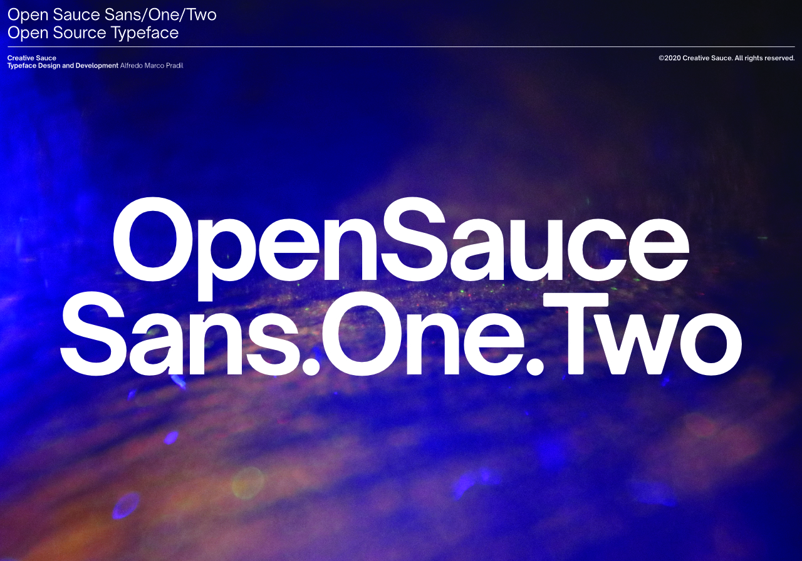

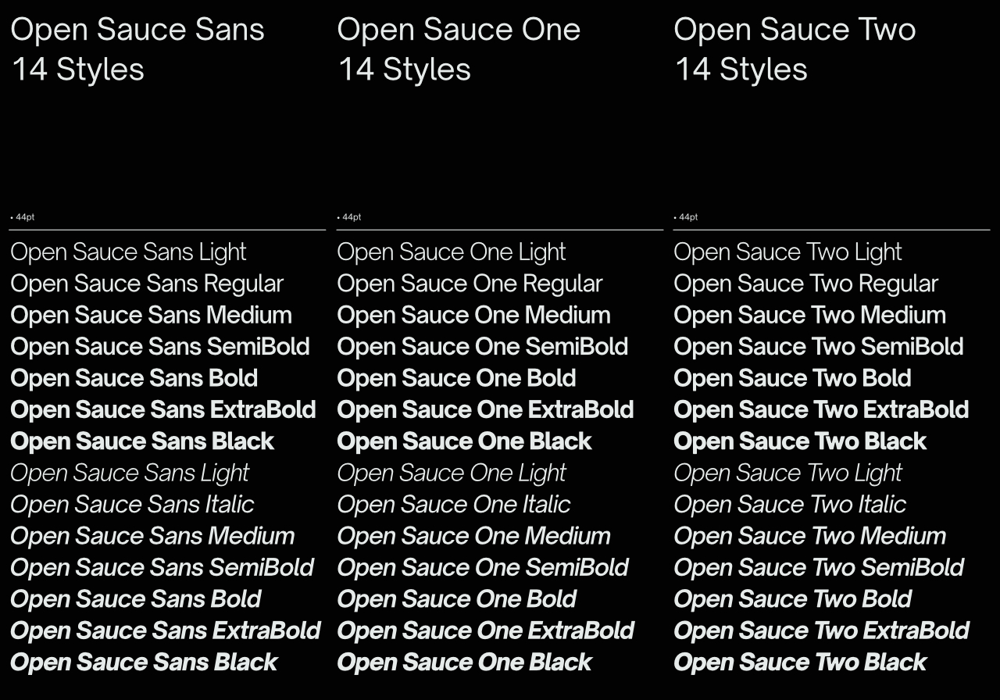

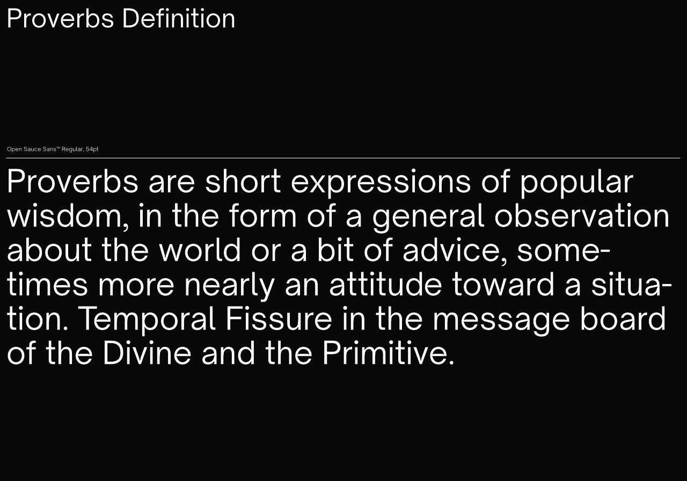

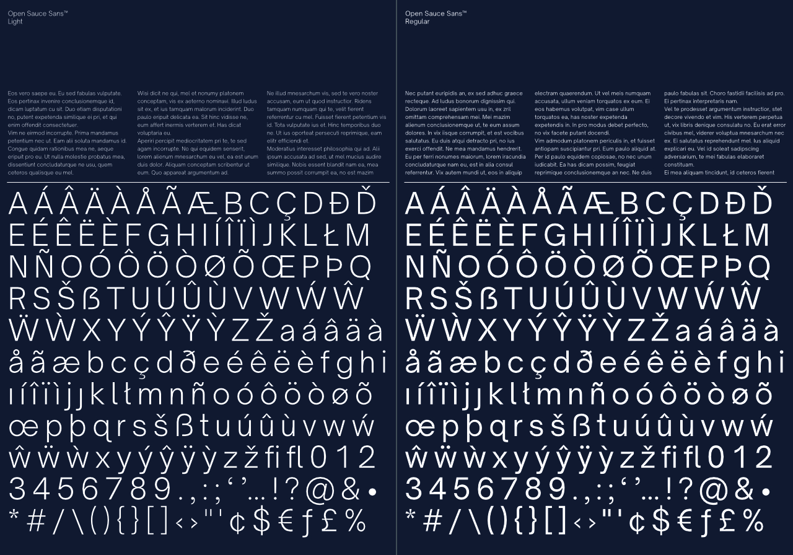

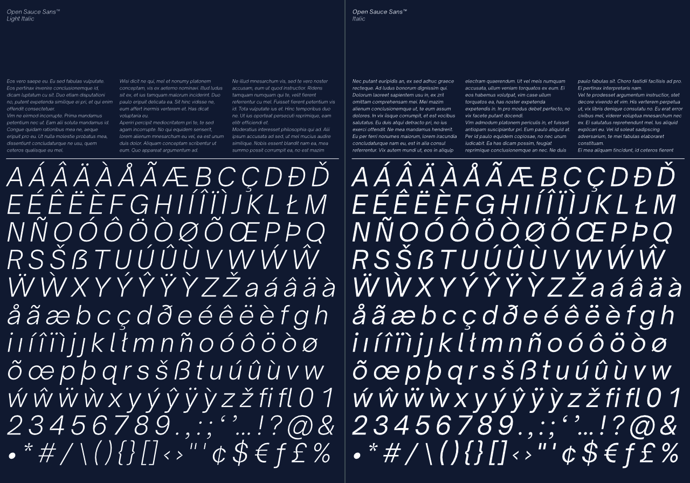

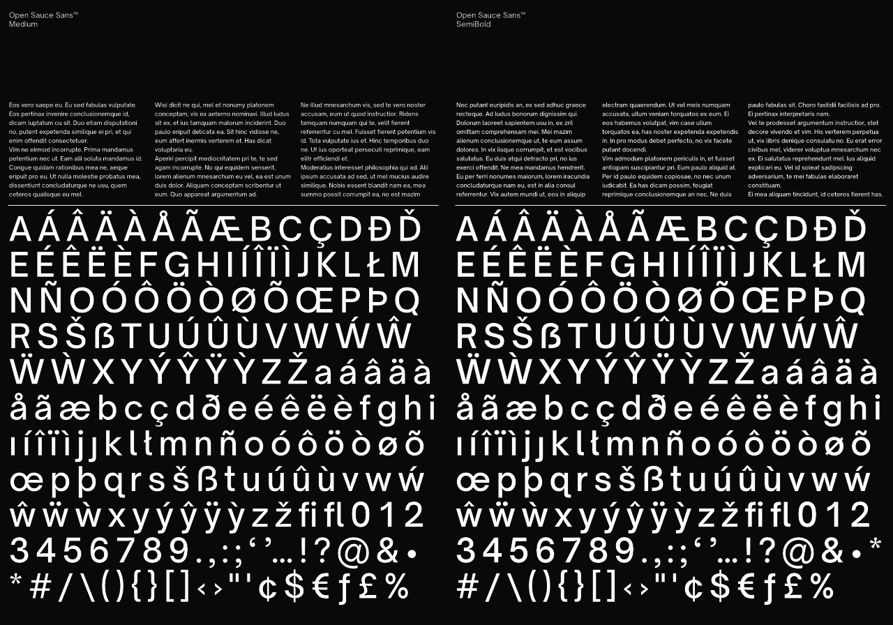

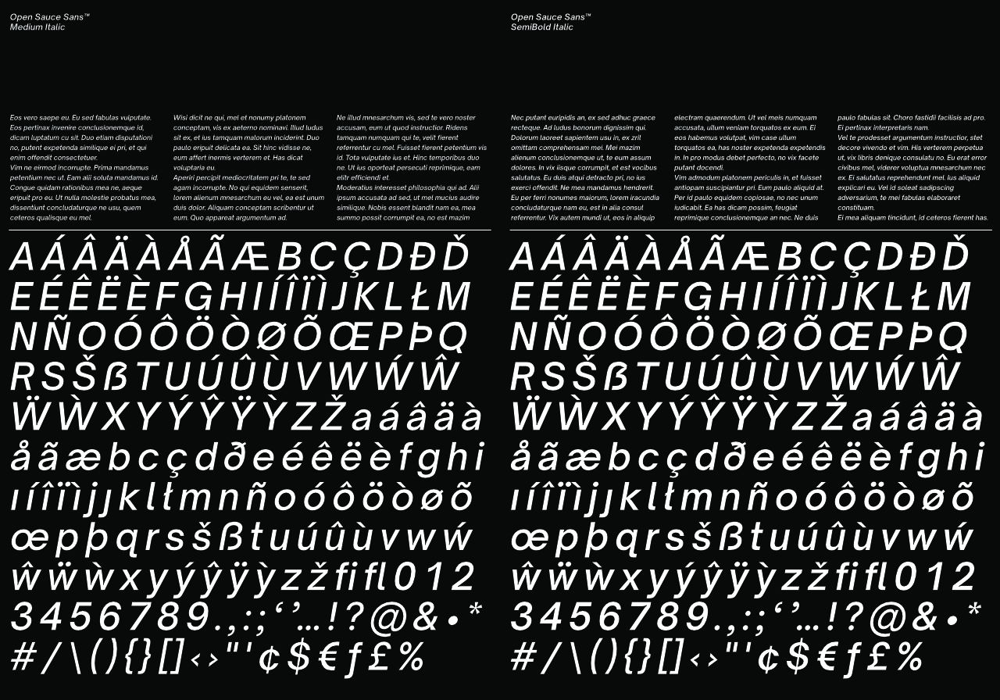

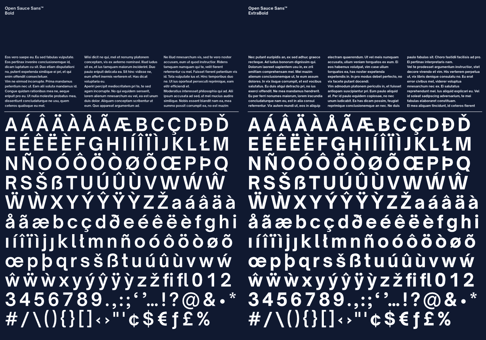

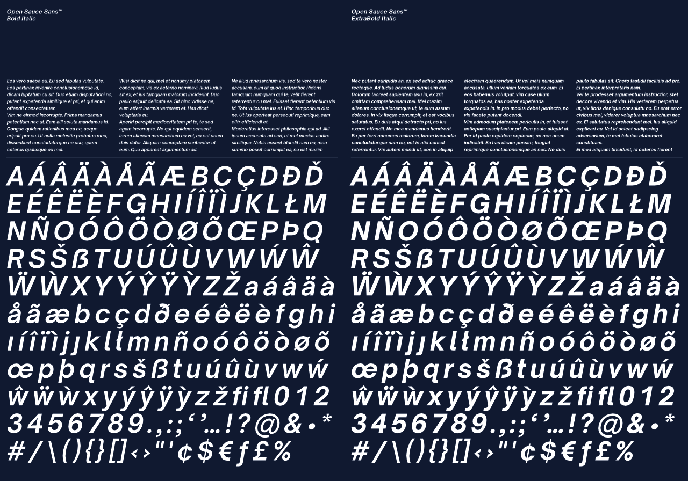

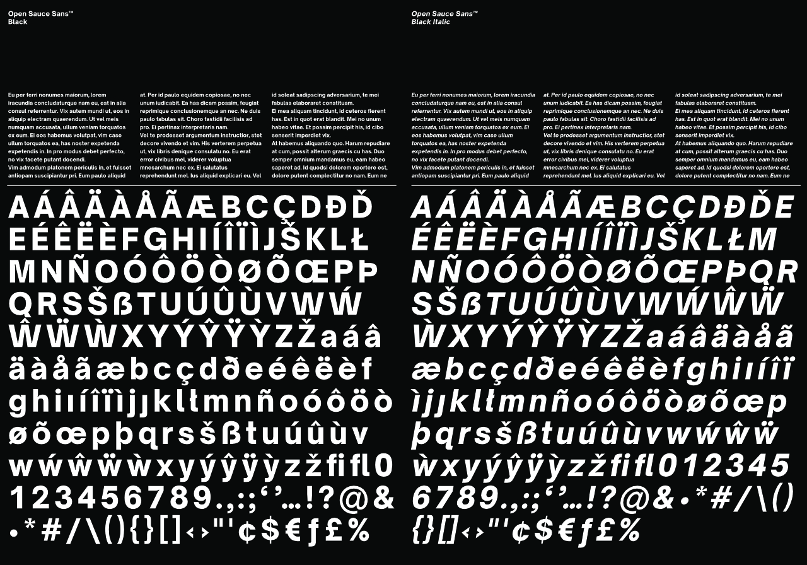

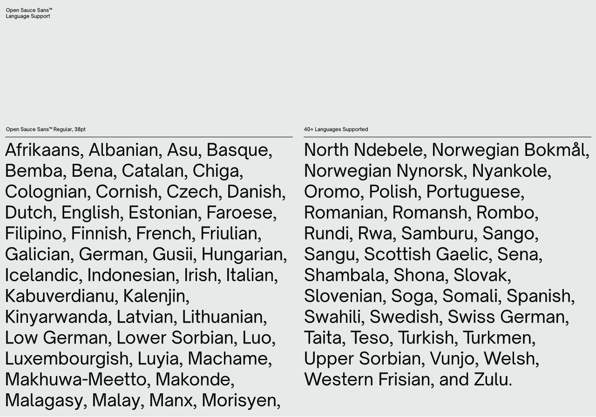

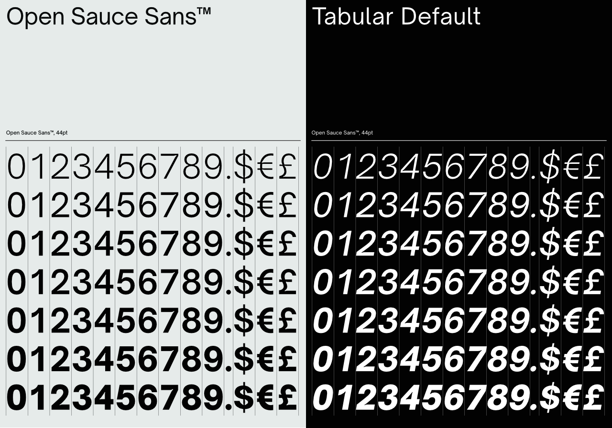

---

### About the Author
Designed and developed by [Alfredo Marco Pradil](https://www.behance.net/pradil). The family will continue to be improved, tested, and expanded as an open-source project.
